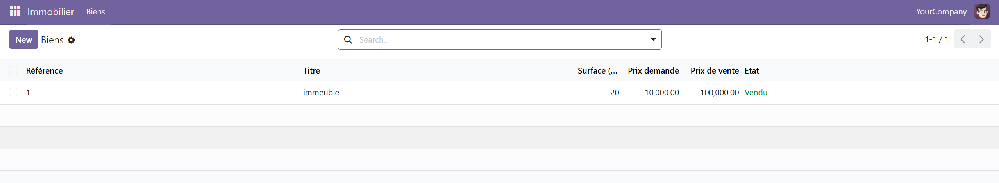
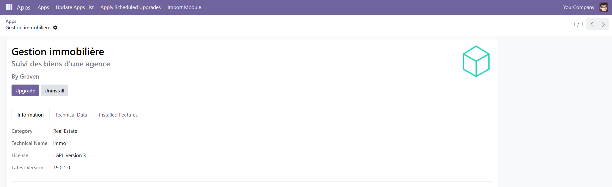

# Gestion Immobilière (Odoo Module)

Un module Odoo développé pour la gestion et le suivi des biens immobiliers d'une agence.

## 🚀 Fonctionnalités
* **Gestion des biens immobiliers** : Suivi des titres, des références, des surfaces et des prix (demandés et de vente).
* **États dynamiques** : Gestion des statuts (*Disponible*, *Offre reçue*, *Vendu*) avec des codes couleur visuels dans la liste.
* **Sécurité et Rôles** : Configuration des droits d'accès pour les utilisateurs.

## 📸 Captures d'écran

| Vue Liste | Formulaire / Détails |
| :---: | :---: |
|  |  |

## 🛠️ Prérequis
* [Docker](https://www.docker.com/)
* [Docker Compose](https://docs.docker.com/compose/)

## ⚙️ Installation & Lancement avec Docker

1. **Cloner le dépôt :**
   ```bash
   git clone [https://github.com/fz-hazem/immo-bien.git](https://github.com/fz-hazem/immo-bien.git)
   cd immo-bien
docker-compose up -d
Accéder à Odoo :
Ouvrez votre navigateur et rendez-vous sur :
http://localhost:8069

immo-bien/
├── models/          # Définition des modèles de données Python (ex: bien.py)
├── views/           # Fichiers XML des vues et menus (ex: bien_views.xml)
├── security/        # Droits d'accès (ex: ir.model.access.csv)
├── __manifest__.py  # Fichier de configuration du module
└── docker-compose.yml

Pour rédiger un README professionnel et visuel pour votre projet GitHub, il est conseillé de suivre une structure claire en Markdown (`.md`) qui met en valeur votre travail, explique son installation via Docker, et intègre des captures d'écran de votre application Odoo.

Voici un modèle prêt à l'emploi que vous pouvez adapter et enregistrer sous le nom de `README.md` à la racine de votre projet :

```markdown
# Gestion Immobilière (Odoo Module)

Un module Odoo développé pour la gestion et le suivi des biens immobiliers d'une agence.

## 🚀 Fonctionnalités
* **Gestion des biens immobiliers** : Suivi des titres, des références, des surfaces et des prix (demandés et de vente).
* **États dynamiques** : Gestion des statuts (*Disponible*, *Offre reçue*, *Vendu*) avec des codes couleur visuels dans la liste.
* **Sécurité et Rôles** : Configuration des droits d'accès pour les utilisateurs.

## 📸 Captures d'écran

| Vue Liste | Formulaire / Détails |
| :---: | :---: |
|  |  |

*(Note : Remplacez les chemins ci-dessus par l'emplacement réel de vos images dans votre dépôt)*

## 🛠️ Prérequis
* [Docker](https://www.docker.com/)
* [Docker Compose](https://docs.docker.com/compose/)

## ⚙️ Installation & Lancement avec Docker

1. **Cloner le dépôt :**
   ```bash
   git clone [https://github.com/votre-nom-utilisateur/votre-repo.git](https://github.com/votre-nom-utilisateur/votre-repo.git)
   cd nom-du-repo

```

2. **Lancer les conteneurs :**
```bash
docker-compose up -d

```


3. **Accéder à Odoo :**
Ouvrez votre navigateur et rendez-vous sur :
`http://localhost:8069`

## 📂 Structure du Projet

```text
immo-bien/
├── models/          
├── views/           
├── security/        
├── __manifest__.py  
└── docker-compose.yml

```

## 📜 Licence

Ce projet est sous licence [LGPL-3](https://www.google.com/search?q=LICENSE).
